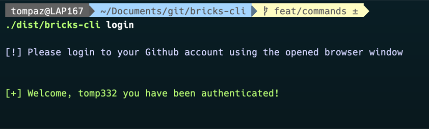
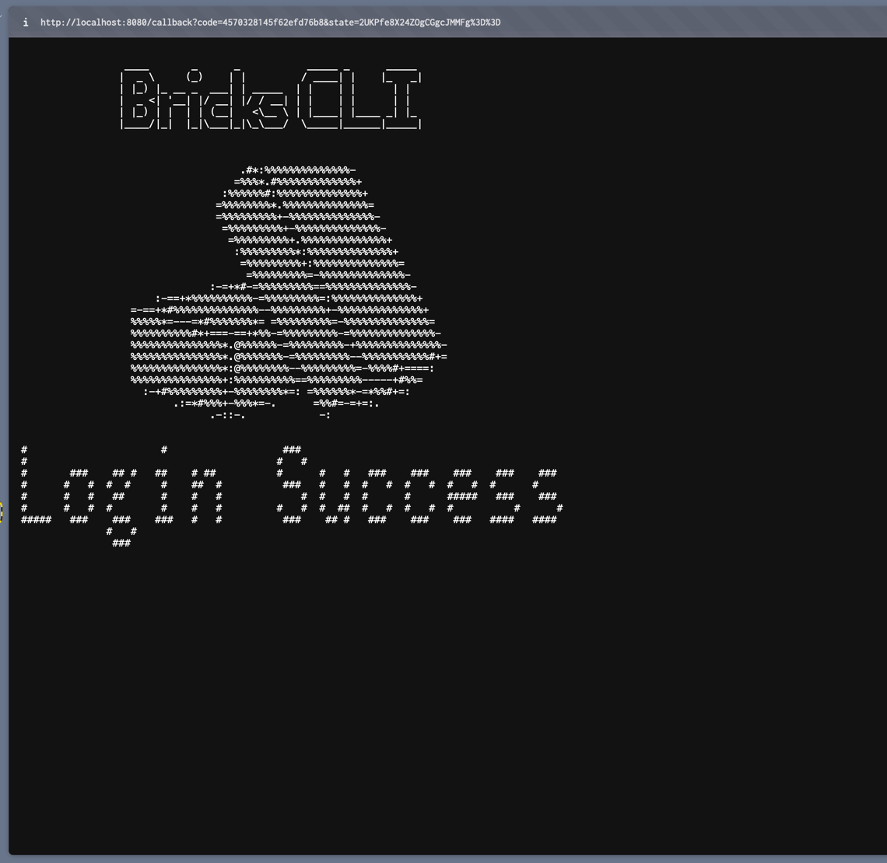

# Bricks CLI

## Getting Started

```shell
git clone https://github.com/tomp332/bricks-cli.git
cd bricks-cli
# For MacOs users, just run the CLI
./dist/bricks-cli 
```

For non MacOS users, compile the CLI:

```shell
mkdir dist
# Linux users
GOOS=linux GOARCH=amd64 go build -o dist/bluebricks-cli-linux
# Windows users
GOOS=windows GOARCH=amd64 go build -o dist/bluebricks-cli.exe
```

## Usage


### Available commands

`bricks-cli` currently supports `login`, `logout`, `status` commands. 

```sh
# To log in using github 0Auth
bricks-cli login

# To check login status
bricks-cli status

# To logout
bricks-cli logout
```


### Github Login 


#### Steup 1

In order for these commands to work properly,

0Auth application configuration is needed in your current Github user settings.

Tutorial to create a new app can be found [here](https://docs.github.com/en/apps/oauth-apps/building-oauth-apps/creating-an-oauth-app).


#### Step 2

Create a config.json file to pass the correct Github application data needed for authentication.

`config.json` file example:
```json
{
  "github_auth": {
    "github_client_id": "<GITHUB_CLIENT_ID>",
    "github_client_secret": "<GITHUB_CLIENT_SECRET>"
  }
}
```

After this file is created, you can work with the CLI commands as expected, without passing any additional flags.

#### Step 3

```shell
./dist/bricks-cli login
```

##### Output



### Demos


### Successful Authentication

Upon successful authentication, your authenticated web page should display the following:



